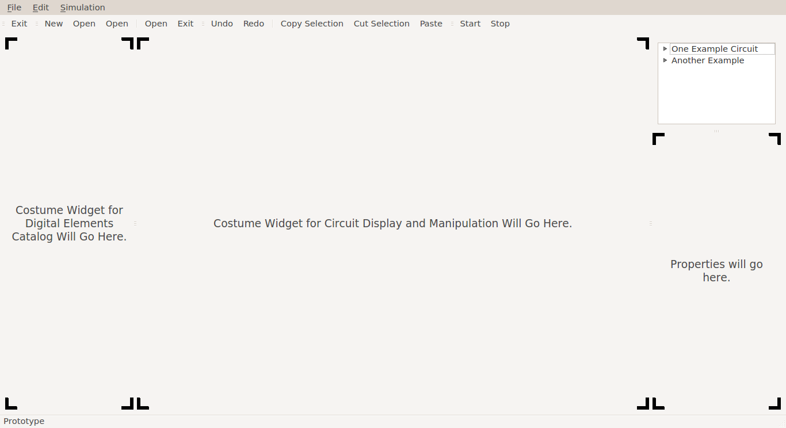

This is a temporary project that serves as a prototype for the BinPy GUI project proposal done in the scope of Google Summer of Code 2014.

Context for this project is in [this blog post](http://petermlm.wordpress.com/2014/04/11/prototype-for-the-binpy-gui-project/).

To execute just run:

```
python src/test.py
```

